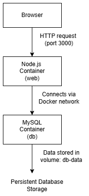
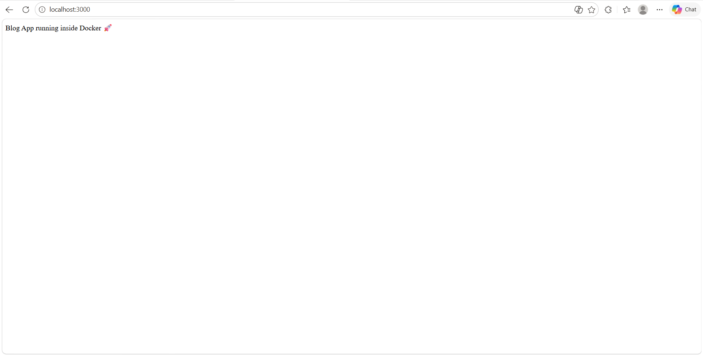
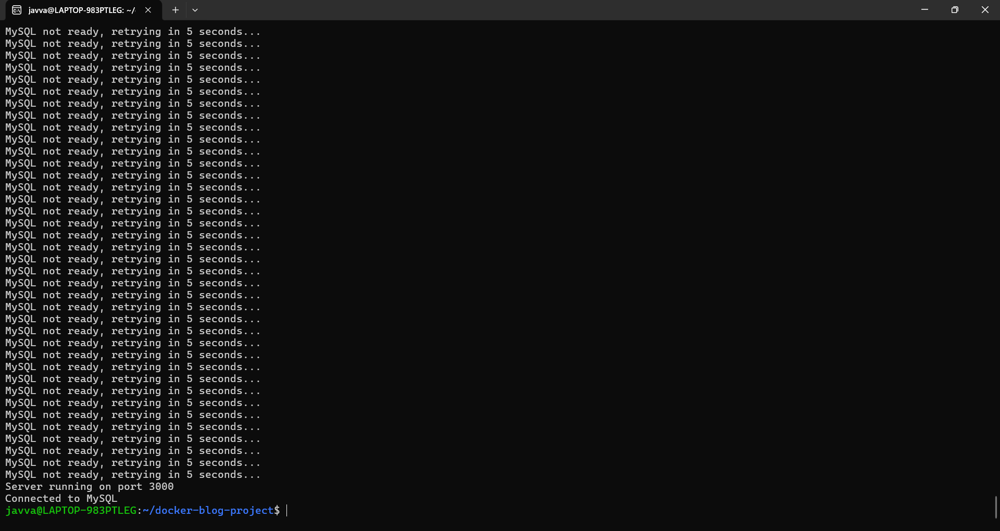

# Docker Node.js + MySQL Project

## Description
This project is a simple Node.js application connected to a MySQL database, running entirely inside Docker containers. Docker Compose is used to orchestrate multiple containers, handle networking, and manage persistent database storage.

---

## Architecture

*Explanation:*
- *Browser* → Sends HTTP requests to the Node.js container on port 3000
- *Node.js container (web)* → Handles application logic, connects to MySQL
- *MySQL container (db)* → Stores database tables
- *Docker volume (db-data)* → Persists database data
- *Docker network (blog-network)* → Allows containers to communicate

---

## Prerequisites
- Docker
- Docker Compose

---

## Project Structure

docker-blog-project
├── README.md
├── app
│ └── app.js
├── Dockerfile
├── docker-compose.yml
├── package.json
├── screenshots
│ └── app-running.png
├── architecture.png
└── logs.png

## Project instructions

---

## Setup Instructions

1. **Clone the repository**
   - git clone https://github.com/RohiniJ1204/docker-blog-project.git

2. **Go to project folder**
   - cd docker-blog-project

3. **Start the containers**
   - docker compose up --build

4. **Open the app in your browser**
   - http://localhost:3000

---

## Screenshots

**App Running**

 
**Logs Output**

---

## Notes
- Database data is persisted using the Docker volume db-data.
- Node.js container connects to MySQL container using service name db.
- Ports used:
  - Node.js → 3000
  - MySQL → 3306 (internal container port)
- Environment variables can be configured in .env (use .env.example as a template).

---

## Optional Improvements
- Add authentication and API routes for Node.js.
- Use .env for secure credentials.
- Add more screenshots for different app features.
- Implement automated tests for Node.js routes.
- Use Docker healthchecks and logs monitoring for production.

---

## Author
- *Name:* Rohini Javvaji
- *GitHub:* [Rohini Javvaji](https://github.com/RohiniJ1204)
- *Email:* rohini.javvaji.dev@gmail.com

